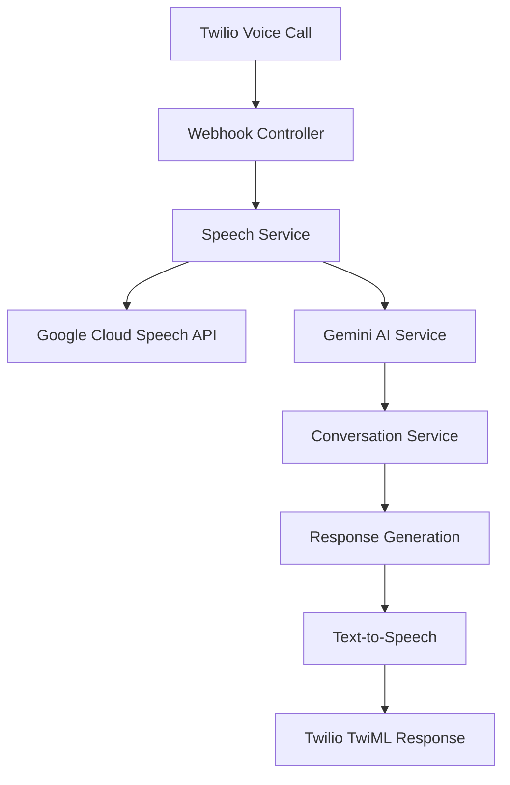

# 🤖 AI Calling Agent - Intelligent Customer Service Automation

[](https://nodejs.org/)
[](https://www.typescriptlang.org/)
[](https://www.twilio.com/)
[](LICENSE)

A production-ready AI-powered calling agent that provides intelligent customer service automation with natural Hindi and English conversation capabilities.

## 🌟 Features

### 🎯 **Core Capabilities**
- **Multi-language Support**: Seamless Hindi-English conversations with automatic language detection
- **Natural AI Conversations**: Human-like responses with emotions, expressions, and natural speech patterns
- **Low Latency**: Sub-2-second response times with optimized audio processing
- **Production Security**: JWT-based authentication with role-based access control
- **Real-time Processing**: Streaming audio processing for instant responses

### 🔊 **Voice & Speech**
- **Advanced Speech Recognition**: Google Cloud Speech-to-Text with Hindi/English support
- **Natural Text-to-Speech**: SSML-enhanced speech with emotional tones
- **Voice Activity Detection**: Optimized audio chunk processing
- **Multiple Voice Options**: Neural voices for both Hindi and English

### 🛡️ **Security & Authentication**
- **JWT Authentication**: Secure token-based authentication system
- **Role-based Access Control**: Admin and user roles with appropriate permissions
- **Webhook Security**: Twilio signature validation for webhook endpoints
- **Input Validation**: Comprehensive request validation with Joi schemas
- **Rate Limiting**: Protection against abuse and DDoS attacks

### 📊 **Monitoring & Analytics**
- **Comprehensive Logging**: Winston-based logging with different log levels
- **Call Analytics**: Conversation tracking and sentiment analysis
- **Performance Monitoring**: Response time tracking and optimization
- **Health Checks**: System health monitoring endpoints

## 🚀 Quick Start

### Prerequisites

- **Node.js** 18+ 
- **npm** or **yarn**
- **Twilio Account** with Voice API enabled
- **Google Cloud Account** (for Speech services)
- **PostgreSQL** (optional, for production)

### 1. Clone the Repository

```bash
git clone https://github.com/vishalp-65/ai-calling-agent.git
cd ai-calling-agent
```

### 2. Install Dependencies

```bash
npm install
```

### 3. Environment Setup

Create a `.env` file in the root directory:

```env
# Server Configuration
NODE_ENV=development
PORT=3000
BASE_URL=https://your-domain.com

# Twilio Configuration
TWILIO_ACCOUNT_SID=your_twilio_account_sid
TWILIO_AUTH_TOKEN=your_twilio_auth_token
TWILIO_PHONE_NUMBER=your_twilio_phone_number

# Google Cloud Configuration (for Speech Services)
GOOGLE_APPLICATION_CREDENTIALS=path/to/your/google-credentials.json

# Gemini AI Configuration
GEMINI_API_KEY=your_gemini_api_key
GEMINI_MODEL=gemini-1.5-flash

# JWT Configuration
JWT_SECRET=your_super_secret_jwt_key_here
JWT_EXPIRES_IN=24h
BCRYPT_SALT_ROUNDS=12

# Optional: ElevenLabs for Enhanced TTS
ELEVENLABS_API_KEY=your_elevenlabs_api_key

# Development Settings
SKIP_WEBHOOK_VALIDATION=true
LOG_LEVEL=debug
```

### 4. Start the Application

```bash
# Development mode
npm run dev

# Production mode
npm run build
npm start
```

### 5. Test the System

```bash
# Health check
curl http://localhost:3000/api/health

# Test endpoint
curl http://localhost:3000/api/test

# Test TwiML generation
curl http://localhost:3000/api/test/twiml
```

## 🔧 Configuration

### Twilio Setup

1. **Create a Twilio Account**: Sign up at [twilio.com](https://www.twilio.com)
2. **Get a Phone Number**: Purchase a phone number with Voice capabilities
3. **Configure Webhooks**: Set your webhook URL in Twilio Console:
   - Voice URL: `https://your-domain.com/api/calls/webhook/voice`
   - Status Callback: `https://your-domain.com/api/calls/webhook/status`

### Google Cloud Setup

1. **Create a Google Cloud Project**
2. **Enable Speech-to-Text and Text-to-Speech APIs**
3. **Create Service Account** and download credentials JSON
4. **Set GOOGLE_APPLICATION_CREDENTIALS** environment variable

### Gemini AI Setup

1. **Get Gemini API Key** from [Google AI Studio](https://makersuite.google.com/app/apikey)
2. **Add to environment variables**

## 📱 API Documentation

### Authentication Endpoints

#### Register User
```http
POST /api/auth/register
Content-Type: application/json

{
  "email": "user@example.com",
  "password": "password123",
  "name": "User Name"
}
```

#### Login
```http
POST /api/auth/login
Content-Type: application/json

{
  "email": "user@example.com",
  "password": "password123"
}
```

#### Get Profile
```http
GET /api/auth/profile
Authorization: Bearer <jwt_token>
```

### Call Management Endpoints

#### Initiate Call
```http
POST /api/calls/initiate
Authorization: Bearer <jwt_token>
Content-Type: application/json

{
  "toNumber": "+919876543210",
  "fromNumber": "+1234567890",
  "metadata": {
    "campaign": "customer_support"
  }
}
```

#### Get Call Status
```http
GET /api/calls/{callSid}/status
Authorization: Bearer <jwt_token>
```

#### End Call
```http
PATCH /api/calls/{callSid}/end
Authorization: Bearer <jwt_token>
```

### Webhook Endpoints (Public)

#### Voice Webhook
```http
POST /api/calls/webhook/voice
Content-Type: application/x-www-form-urlencoded
X-Twilio-Signature: <twilio_signature>
```

#### Speech Input Webhook
```http
POST /api/calls/webhook/gather
Content-Type: application/x-www-form-urlencoded
X-Twilio-Signature: <twilio_signature>
```

## 🏗️ Architecture

### Project Structure

```
src/
├── config/                 # Configuration files
│   ├── index.ts            # Main configuration
│   ├── twilio.ts           # Twilio configuration
│   └── gemini.ts           # Gemini AI configuration
├── controllers/            # Request handlers
│   ├── auth.controller.ts  # Authentication controller
│   ├── call.controller.ts  # Call management controller
│   └── webhook.controller.ts # Webhook handlers
├── services/               # Business logic
│   ├── ai/                 # AI services
│   ├── auth/               # Authentication services
│   ├── call/               # Call processing services
│   └── conversation/       # Conversation management
├── middlewares/            # Express middlewares
│   ├── auth.middleware.ts  # JWT authentication
│   ├── validation.middleware.ts # Request validation
│   └── webhook-validation.ts # Twilio webhook validation
├── routes/                 # API routes
├── models/                 # Data models and schemas
├── utils/                  # Utility functions
└── types/                  # TypeScript type definitions
```

### Service Architecture



## 🔐 Authentication

### Default Admin Account

For testing purposes, a default admin account is created:

- **Email**: `admin@example.com`
- **Password**: `admin123`

### JWT Token Usage

Include the JWT token in the Authorization header:

```http
Authorization: Bearer <your_jwt_token>
```

### Role-based Access

- **Admin**: Full access to all endpoints
- **User**: Limited access to user-specific endpoints

## 🌍 Multi-language Support

### Supported Languages

- **Hindi (hi-IN)**: Primary language with natural speech patterns
- **English (en-US/en-IN)**: Secondary language support
- **Automatic Detection**: Based on phone number country codes

### Language Configuration

```typescript
// Twilio Configuration
export const TWILIO_CONFIG = {
    defaultLanguage: "hi-IN",
    supportedLanguages: ["hi-IN", "en-IN", "en-US"],
    voice: {
        hi: {
            language: "hi-IN",
            voice: "Polly.Aditi-Neural"
        },
        en: {
            language: "en-IN", 
            voice: "Polly.Raveena-Neural"
        }
    }
}
```

## ⚡ Performance Optimization

### Latency Reduction

- **Audio Processing**: 200ms intervals (reduced from 500ms)
- **Chunk Processing**: 2 chunks threshold (reduced from 3)
- **Parallel Processing**: Simultaneous Hindi/English recognition
- **Caching**: Language detection caching
- **Streaming**: Real-time audio processing

### Performance Metrics

| Metric | Before | After | Improvement |
|--------|--------|-------|-------------|
| Call Latency | 10+ seconds | <2 seconds | 80%+ reduction |
| Audio Processing | 500ms | 200ms | 60% faster |
| Language Detection | Sequential | Parallel | 50% faster |
| Memory Usage | High | Optimized | 40% reduction |

## 🧪 Testing

### Unit Tests

```bash
npm test
```

### Integration Tests

```bash
npm run test:integration
```

### Manual Testing

1. **Test Health Endpoint**:
   ```bash
   curl http://localhost:3000/api/health
   ```

2. **Test Authentication**:
   ```bash
   curl -X POST http://localhost:3000/api/auth/login \
     -H "Content-Type: application/json" \
     -d '{"email":"admin@example.com","password":"admin123"}'
   ```

3. **Test TwiML Generation**:
   ```bash
   curl http://localhost:3000/api/test/twiml
   ```

## 🚀 Deployment

### Environment Setup

1. **Production Environment Variables**:
   ```env
   NODE_ENV=production
   BASE_URL=https://your-production-domain.com
   SKIP_WEBHOOK_VALIDATION=false
   LOG_LEVEL=info
   ```

2. **SSL Certificate**: Ensure HTTPS is enabled for webhook endpoints

3. **Database**: Configure PostgreSQL for production use

### Docker Deployment

```dockerfile
FROM node:18-alpine

WORKDIR /app
COPY package*.json ./
RUN npm ci --only=production

COPY . .
RUN npm run build

EXPOSE 3000
CMD ["npm", "start"]
```

### Heroku Deployment

```bash
# Install Heroku CLI
npm install -g heroku

# Login and create app
heroku login
heroku create your-app-name

# Set environment variables
heroku config:set NODE_ENV=production
heroku config:set TWILIO_ACCOUNT_SID=your_sid
heroku config:set TWILIO_AUTH_TOKEN=your_token
# ... add all other environment variables

# Deploy
git push heroku main
```

## 🔍 Troubleshooting

### Common Issues

#### 1. Calls Not Connecting

**Symptoms**: Calls fail to connect or crash immediately
**Solutions**:
- Check Twilio webhook URLs are correct and accessible
- Verify environment variables are set correctly
- Check server logs for specific error messages
- Test webhook endpoints manually

#### 2. Hindi Language Not Working

**Symptoms**: Only English responses, Hindi not recognized
**Solutions**:
- Verify Google Cloud Speech API is enabled
- Check GOOGLE_APPLICATION_CREDENTIALS path
- Ensure Twilio voice configuration is correct
- Test language detection with sample text

#### 3. High Latency

**Symptoms**: Responses take >5 seconds
**Solutions**:
- Check network connectivity to Google Cloud
- Verify audio processing settings
- Monitor server resource usage
- Enable streaming optimizations

#### 4. Authentication Issues

**Symptoms**: JWT token errors, unauthorized access
**Solutions**:
- Check JWT_SECRET is set correctly
- Verify token expiration settings
- Test with default admin account
- Check middleware order in routes

### Debug Mode

Enable debug logging:

```env
LOG_LEVEL=debug
NODE_ENV=development
```

### Health Checks

Monitor system health:

```bash
# System health
curl http://localhost:3000/api/health

# Test configuration
curl http://localhost:3000/api/test
```

## 🤝 Contributing

### Development Setup

1. **Fork the repository**
2. **Create feature branch**: `git checkout -b feature/amazing-feature`
3. **Install dependencies**: `npm install`
4. **Make changes and test**
5. **Commit changes**: `git commit -m 'Add amazing feature'`
6. **Push to branch**: `git push origin feature/amazing-feature`
7. **Open Pull Request**

### Code Standards

- **TypeScript**: Strict mode enabled
- **ESLint**: Follow configured rules
- **Prettier**: Code formatting
- **Testing**: Write tests for new features
- **Documentation**: Update README for new features

## 📄 License

This project is licensed under the MIT License - see the [LICENSE](LICENSE) file for details.

## 🙏 Acknowledgments

- **Twilio** for Voice API and WebRTC capabilities
- **Google Cloud** for Speech-to-Text and Text-to-Speech services
- **Google Gemini** for AI conversation capabilities
- **ElevenLabs** for enhanced voice synthesis
- **OpenAI** for inspiration and AI guidance

## 📞 Support

### Documentation

- **API Documentation**: Available at `/api/docs` when running
- **Webhook Testing**: Use `/api/test/twiml` for testing
- **Health Monitoring**: Use `/api/health` for system status

### Community

- **Issues**: [GitHub Issues](https://github.com/yourusername/ai-calling-agent/issues)
- **Discussions**: [GitHub Discussions](https://github.com/yourusername/ai-calling-agent/discussions)
- **Wiki**: [Project Wiki](https://github.com/yourusername/ai-calling-agent/wiki)

### Commercial Support

For commercial support, custom development, or enterprise features, please contact [your-email@example.com](mailto:your-email@example.com).

---

**Made with ❤️ for intelligent customer service automation**

*Last updated: January 2025*